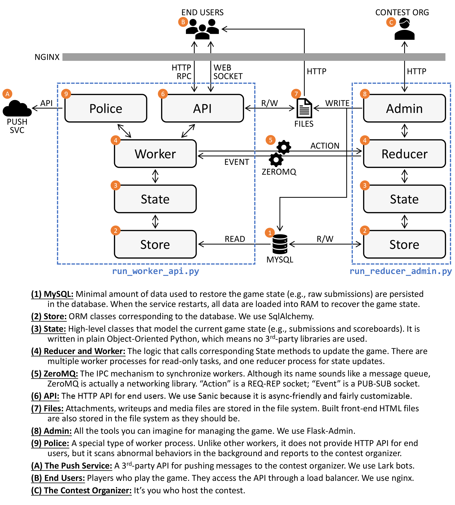
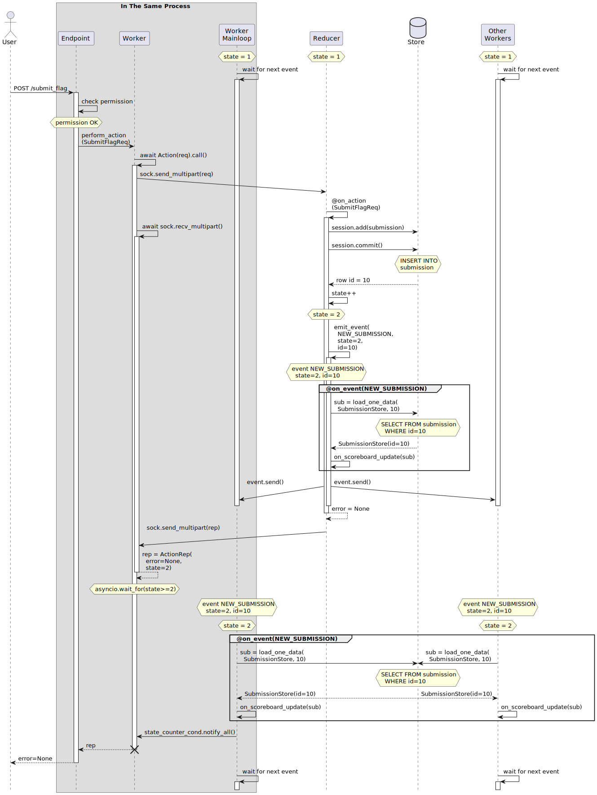

# Project Guiding Star

A CTF contest platform aiming at **maximized possibility of customization** and **a fluid experience for users and developers**.

## Project Index

Backend (in Python) → [PKU-GeekGame/gs-backend](https://github.com/PKU-GeekGame/gs-backend)

Frontend (in React) → [PKU-GeekGame/gs-frontend](https://github.com/PKU-GeekGame/gs-frontend)

Live demo → [geekgame.pku.edu.cn](https://geekgame.pku.edu.cn)

Misc files → This repo

## Architecture

**Overall backend architecture:**

**Case study: when a user submits a flag**

## Setup

Set up the backend: [refer to README from gs-backend](https://github.com/PKU-GeekGame/gs-backend)

Set up the frontend: [refer to README from gs-frontend](https://github.com/PKU-GeekGame/gs-frontend)

Start the backend processes. We use systemd: example configuration for [reducer](gs-reducer.service) and [worker](gs-worker.service) processes.

Use a reverse proxy (we use `nginx`) to proxy requests to backend or frontend: [an example configuration file](example.nginx-host.conf).

To register the first user manually, visit `/service/auth/manual?identity=<your_name>`.
Manual login should be disabled in production environment by configuring `MANUAL_AUTH_ENABLED = False` in `src/secret.py` in the backend codebase.

Visit admin panel at `/<admin_url>`.
`ADMIN_URL` and `IS_ADMIN` can be configured in `src/secret.py` in the backend codebase.

## License

Both backend and frontend is distributed under MIT License. See their LICENSE files for more information.